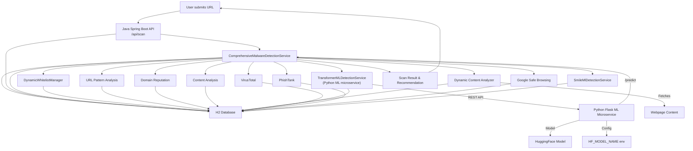
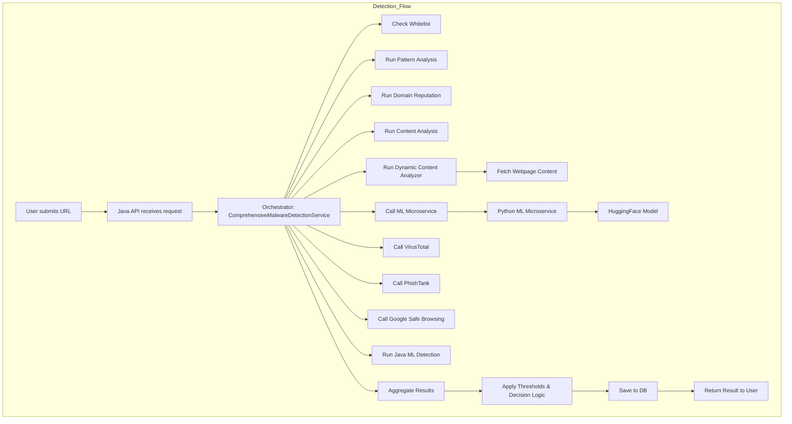

# Malicious URL Detector: System Documentation

## Overview
This system detects malicious and phishing URLs using a combination of traditional heuristics, third-party threat intelligence, and advanced ML models (HuggingFace transformers). It consists of a Java Spring Boot backend and a Python Flask microservice for ML inference.

---

## Architecture Diagram

---

## Detection Flow

---

## Detection Methods & Steps

### 1. Whitelist Check
- Checks if the domain is in the dynamic whitelist (auto-learns from false positives).

### 2. URL Pattern Analysis
- Uses regex to detect suspicious patterns (see below for regex explanations).

### 3. Domain Reputation
- Flags suspicious TLDs, long/random domains, excessive subdomains, and brand impersonation.

### 4. Content Analysis
- Fetches and scans webpage content for suspicious scripts, iframes, redirects, obfuscation, and keywords.

### 5. Dynamic Content Analyzer
- Visits the URL, fetches content, and applies advanced heuristics and regex.

### 6. ML Microservice (TransformerMLDetectionService)
- Calls the Python Flask microservice, which uses a HuggingFace transformer model to classify the URL (and optionally content) as safe or malicious.

### 7. VirusTotal, PhishTank, Google Safe Browsing
- Integrates with third-party APIs for threat intelligence (if API keys are configured).

### 8. Java ML Detection (SmileMlDetectionService)
- Uses statistical heuristics and feature extraction for risk scoring.

---

## Regex Patterns Explained

### URL Pattern Analysis (UrlPatternDetectionService)
- **IP Address**: `\b(?:\d{1,3}\.){3}\d{1,3}\b`  
  *Matches URLs using raw IPs (e.g., http://192.168.1.1)*
- **Suspicious Keywords**: `(?i)(malware|virus|trojan|spyware|phishing|scam|...)`  
  *Flags URLs with common malware/phishing terms*
- **Suspicious TLDs**: `(?i)\.(tk|ml|ga|cf|gq|xyz|...)$`  
  *Flags cheap/abused TLDs (e.g., .tk, .ml)*
- **Long Random Strings**: `[a-zA-Z0-9]{20,}`  
  *Detects encoded/obfuscated or random-looking URLs*
- **Multiple Subdomains**: `([a-zA-Z0-9-]+\.){3,}[a-zA-Z]{2,}`  
  *Detects excessive subdomain chains*
- **Suspicious URL Structures**: `(?i)(wp-admin|admin|signin|banking|...)`  
  *Flags admin/login/payment paths*
- **URL Shorteners**: `(?i)(bit\.ly|tinyurl|goo\.gl|...)`  
  *Flags known shortener services*
- **Suspicious Domain Patterns**: `(?i)(phishing|scam|fake|malicious|...)`  
  *Flags domains with suspicious words*
- **Brand Impersonation**: `(?i)(paypal-secure|google-secure|...)`  
  *Detects fake brand logins*

### Content Analysis/Dynamic Content Analyzer
- **Suspicious JS**: `(?i)(eval\s*\(|Function\s*\(|unescape|fromCharCode|...)`  
  *Detects obfuscated or dynamic JS*
- **Phishing Forms**: `(?i)(<form[^>]*>.*?(password|login|username|...)[^>]*>)`  
  *Detects forms asking for sensitive info*
- **Suspicious Iframes**: `(?i)(<iframe[^>]*src=["']([^"']*)["'][^>]*>)`  
  *Detects hidden/embedded iframes*
- **Redirects**: `(?i)(window\.location|location\.href|...)`  
  *Detects JS/meta redirects*
- **Obfuscated Content**: `(?i)(base64|\\x[0-9a-fA-F]{2}|&#x[0-9a-fA-F]+|%[0-9a-fA-F]{2})`  
  *Detects encoded/obfuscated payloads*
- **Suspicious Keywords**: `(?i)(malware|virus|trojan|...)`  
  *Flags dangerous words in content*

#### Example: 
- URL: `http://paypal-secure-login.com`  
  *Matches brand impersonation and suspicious keyword patterns.*
- Content: ``  
  *Matches suspicious JS and obfuscation patterns.*

---

## Detection Thresholds
See `detection_thresholds.yml` for all tunable thresholds. Each service uses a confidence/risk threshold to decide if a URL is flagged. Whitelisted domains use higher thresholds to reduce false positives.

---

## Model Selection
- See `huggingface_phishing_models.txt` for recommended models.
- To change the model, set `HF_MODEL_NAME` before starting the Python microservice.

---

## Testing
- Use `test_ml_integration.py`, `test_dynamic_analysis.py`, `test_improvements.py`, and `test_malware_detector.py` for comprehensive testing.
- See `test_cases_expanded.txt` for a list of diverse and adversarial test cases.

---

## API Reference
- **Scan URL**: `POST /api/scan?url=https://example.com`
- **ML Health**: `GET /api/scan/ml/health`
- **ML Info**: `GET /api/scan/ml/info`
- **Python ML Predict**: `POST /predict` (JSON: `{ "url": "..." }`)

---

## How It Works (Step-by-Step)
1. User submits a URL to the Java backend.
2. The orchestrator runs all detection services in parallel.
3. Each service applies its own logic, regex, and thresholds.
4. The Python ML microservice is called with the URL (and optionally content).
5. Results are aggregated, thresholds are applied, and a final decision is made.
6. The result is saved to the database and returned to the user.

---

## How to Tune & Extend
- **Thresholds**: Edit `detection_thresholds.yml` and restart the backend.
- **Models**: Edit `HF_MODEL_NAME` and restart the Python microservice.
- **Test Cases**: Add to `test_cases_expanded.txt` and run the test scripts.
- **Regex**: Update patterns in the relevant Java service files for new threats.

---

## Contact & Contribution
For questions, improvements, or contributions, please open an issue or pull request. 